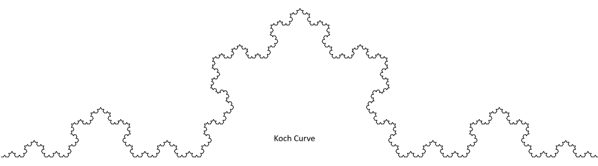
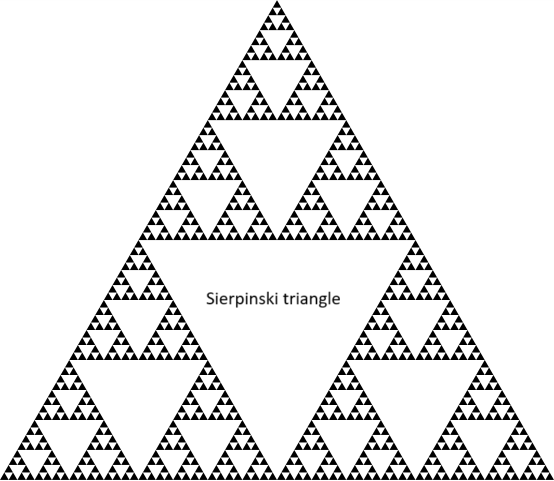
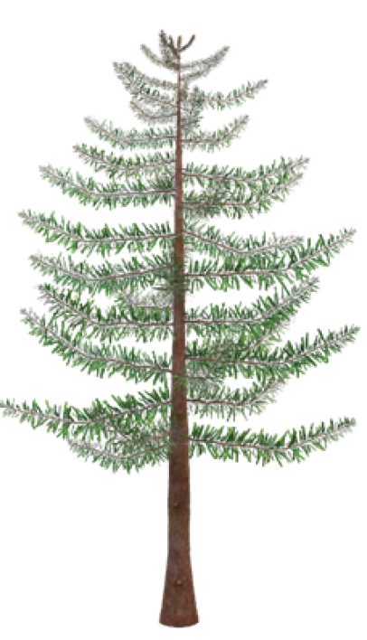
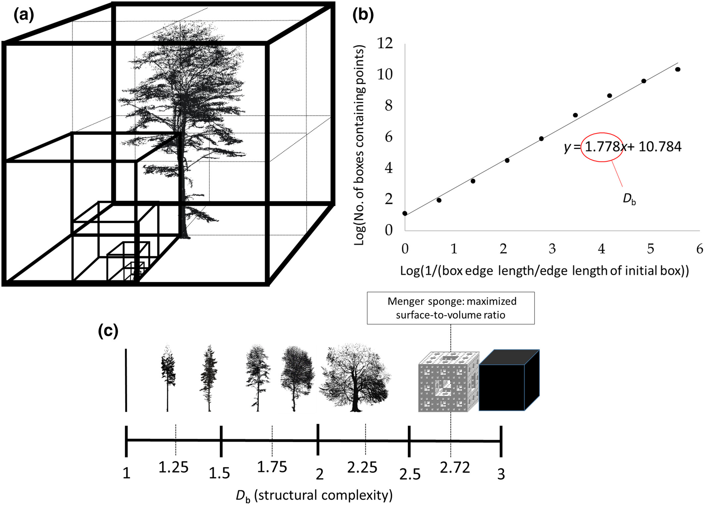
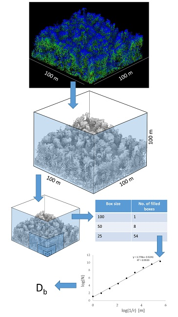
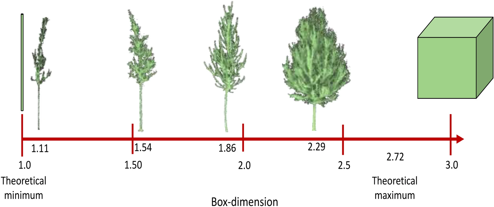

# Introduction

*Clouds are not spheres, mountains are not cones, coastlines are not circles, and bark is not smooth, nor does lightning travel in a straight line.” - Mandelbrot (1983)*

A fractal is a geometric object that shows **self-similarity**; its parts resemble the whole, no matter the scale of observation. Imagine zooming in on a fern leaf, a coastline, or a broccoli head: at each magnification, similar patterns reappear. Unlike simple geometric figures, fractals are **irregular and infinitely nested** in structure. They are found widely in nature and are best described not by whole-number dimensions (like 1D lines or 2D surfaces), but by **fractional, non-integer dimensions**, known as the **fractal dimension**. This dimension is crucial for quantifying the complexity of self-similar systems, whether exact (mathematical fractals) or statistical (natural systems).

## How do you measure the fractal dimension?

The **fractal dimension** quantifies how complex and space-filling a pattern is. Unlike familiar Euclidean dimensions (1D for a line, 2D for a surface), fractal dimensions can take **non-integer values** between whole numbers.

Several methods exist to estimate fractal dimension, but the **box-counting method** is the most widely used. In this approach, the object is covered with boxes of a certain size, and the number of boxes required to contain the shape is counted. This process is repeated with progressively smaller boxes.

If the logarithm of the number of boxes is plotted against the logarithm of the box size, the result is typically a straight line. The **slope of this line** gives the fractal dimension: steeper slopes correspond to more intricate, space-filling structures.

## Why are we discussing this here?

Because **trees are fractal structures.**

Trees exhibit self-similar branching patterns: smaller branches resemble the overall structure of the tree. While we can measure conventional forestry attributes such as height, DBH, basal area, crown dimensions, and volume, these do not capture **overall structural complexity**. To do this, we turn to fractal analysis—specifically the **box dimension**.

## From Euclidean to Fractal Dimension (Quick Intuition)

-   **0-D**: point\
-   **1-D**: line\
-   **2-D**: plane/filled region\
-   **3-D**: solid volume\
-   **Fractal dimension** fills the gaps between integers and quantifies **how space-filling** a structure is.

A classic example is the **Menger sponge**, which has a box dimension ≈ 2.7268. Despite its infinite surface area, it has zero volume, an extreme case of fractal geometry.

## Box Dimension

The **box dimension** is a method of fractal analysis used to quantify the *structural complexity* of an object, often derived from 3D point cloud data. The idea is simple:\
- Cover the object with boxes of decreasing size.\
- Count how many boxes are required to contain the shape.\
- Plot the logarithm of the box count against the logarithm of box size.

If the relationship is linear, the **slope** of that line gives the **box dimension**.

Formally, if the box size is $(\varepsilon)$ and the number of occupied boxes is $N(\varepsilon)$:

$$
N(\varepsilon) \propto \varepsilon^{-D_b}
\quad\Rightarrow\quad
\log N(\varepsilon) = D_b \,\log(1/\varepsilon) + c
$$

Where: - $(D_b)$ is the **box dimension**.\
- For 3D point clouds:\
- $(D_b \approx 1)$: line-like structures\
- $(D_b \approx 2)$: sheet-like structures\
- $(D_b \approx 3)$: volume-filling structures\
- Trees typically have $(D_b)$ between 1.0 and 2.2 (method and data dependent).\
- A higher $R^2$ of the fit indicates stronger self-similarity across scales.

### Data sensitivities

Box dimension estimates depend on: 1. **Point density/resolution**\
2. **Occlusion or shadowing**\
3. **Extent of the scanned scene**\
4. **Scale interval chosen for fitting**

High-quality point clouds (low occlusion, \~0–1 cm spacing) are optimal for robust estimates.

### Box Dimension vs. Voxel Counting

In practice, box-counting in 3D is implemented as **voxel counting**. Voxels are the 3D equivalent of pixels, small cubic volume elements. A point cloud is discretized into a voxel grid, and the occupied voxels are counted at multiple scales.

This process converts a 3D model or point cloud into a grid of voxels, each labeled as “occupied” or “empty.”

### Interpretation

-   **Box dimension ranges from 1 (line) to 3 (solid cube).**\
-   A dimension of **2.72** corresponds to the Menger sponge (infinite surface, zero volume).\
-   **Most trees** fall between **1.0 and 2.2**, reflecting their branching complexity.\
-   Low resolution → oversimplification (underestimates ($D_b$)).\
-   High occlusion → too few boxes at small scales (also biases ($D_b$)).

Thus, careful preprocessing and high-quality scans are critical for meaningful box-dimension analysis.

### How to measure $D_b$ it in reality?

To apply this concept to forests, we calculate the **box-dimension ($(D_b$)** as a measure of tree or stand structural complexity using the **rTwig** package in R.

The algorithm for $(D_b)$ was developed initially in *Mathematica* (Wolfram Research, Champaign, IL, USA) (Seidel, 2018; Ehbrecht, 2019; Basnet, 2025). It integrates **all elements of a scanned scene** into a single value, thereby fully leveraging the potential of 3D laser scanning.

In short:\
- The point cloud of a tree or stand is enclosed in boxes of decreasing size.\
- For each box size, the number of occupied boxes is counted.\
- The scaling relationship between box size and number of boxes gives the **box dimension \$(D_b\$)**.

This workflow is implemented in the **rTwig** R package, making it straightforward to estimate structural complexity directly from normalized point cloud data.

## References

-   Mandelbrot, B. B. (1983). The Fractal Geometry of Nature. W.H. Freeman.

-   Seidel, D. et al. (2019). How a measure of tree structural complexity relates to architectural benefit-to-cost ratio, light availability, and growth of trees. Ecology and Evolution, 9(12), 7134–7142. https://doi.org/10.1002/ece3.5281

-   Seidel, D., Annighöfer, P., Ehbrecht, M., Magdon, P., Wöllauer, S., & Ammer, C. (2020). Deriving Stand Structural Complexity from Airborne Laser Scanning Data—What Does It Tell Us about a Forest? Remote Sensing, 12(11), 1854. https://doi.org/10.3390/rs12111854

-   Dorji, Y., Schuldt, B., Neudam, L., Dorji, R., Middleby, K., Isasa, E., & Körber, K. et al. (2021). Trees, 35(4), 1385–1398. https://doi.org/10.1007/s00468-021-02124-9

-   Basnet, P., Das, S., Hölscher, D., Pierick, K., & Seidel, D. (2025). Drivers of forest structural complexity in mountain forests of Nepal. Mountain Research and Development, 45(1), R1–R10. https://doi.org/10.1659/mrd.2024.00009

-   rTwig vignette (Box Dimension): https://cran.r-project.org/web/packages/rTwig/vignettes/Box-Dimension.html
