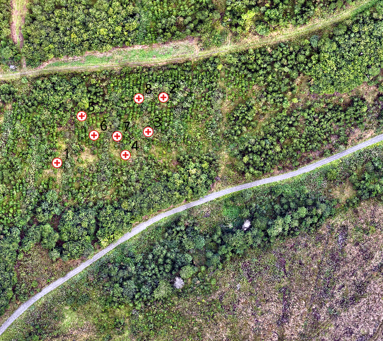
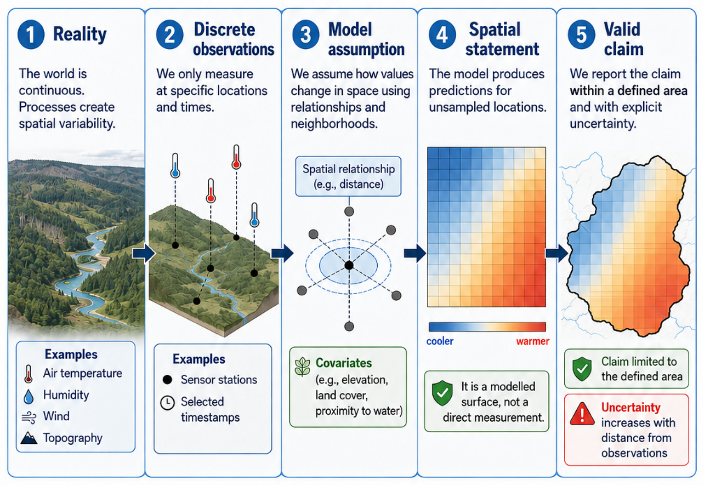
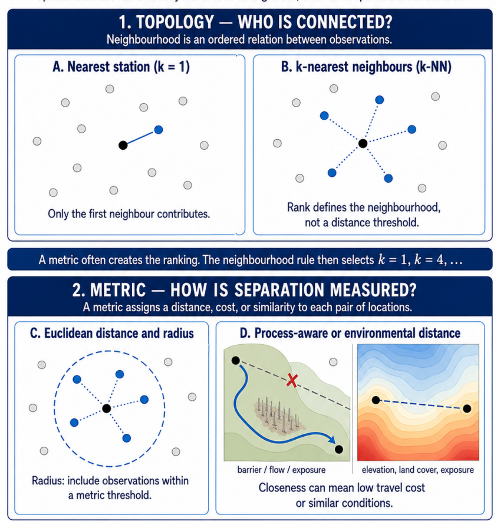
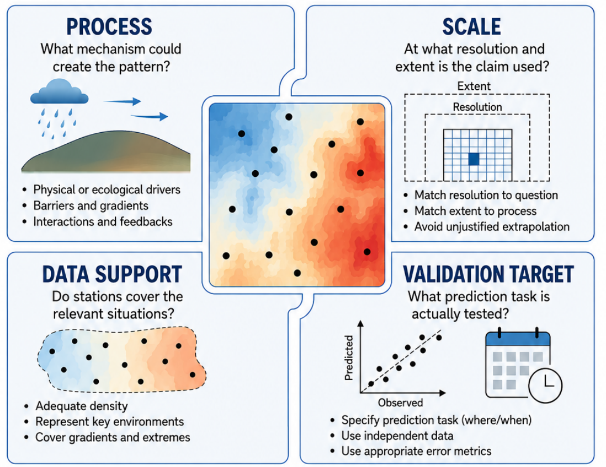
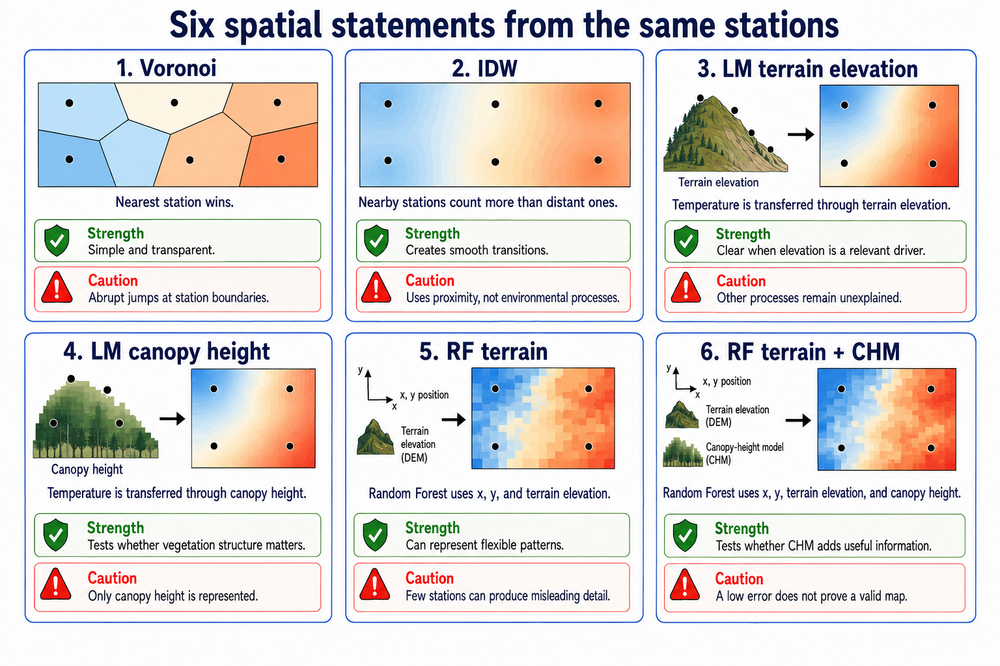
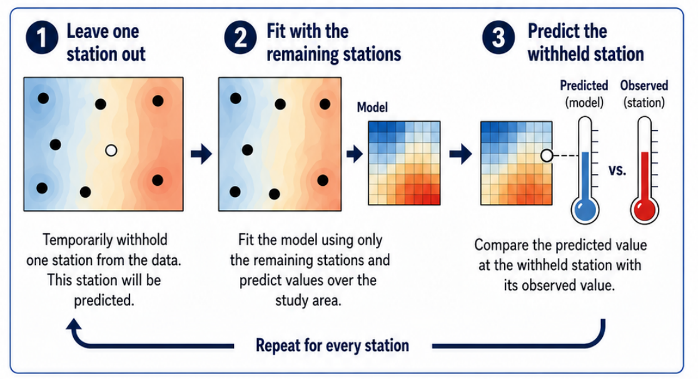

# From points to a map

Eight stations observe eight locations.

A map makes a statement about everywhere in between.

## The central question

> How can incomplete observations become a defensible spatial statement?

A predicted raster is not an additional observation.

It is a modelled transfer from measured to unmeasured locations.

# A point is not a surface

A station observes one location and one time.

A raster cell is a prediction made from an explicit rule.

# Every map makes assumptions

::: {.callout-note appearance="minimal"}
observations

→ transfer rule

→ prediction inside a model domain

→ validation for a specific task

→ bounded claim
:::

The same stations can produce very different maps because the transfer rules differ.

# Neighbourhood and distance

Which stations contribute, and how is separation or similarity measured?

# Four conditions for a defensible map

Process · scale · data support · validation target

# Six transfer assumptions

All models use the same observed temperatures.

They differ in how information is transferred into space.

## The six models in one sentence each

- **Voronoi:** the nearest station wins.
- **IDW:** nearby stations count more than distant ones.
- **LM terrain:** temperature follows one elevation relationship.
- **LM canopy:** temperature follows one canopy-height relationship.
- **RF terrain:** flexible patterns use coordinates and elevation.
- **RF terrain + CHM:** canopy height is added to the same RF model.

## What a model does not know

- Voronoi and IDW do not know terrain, shade, or vegetation.
- Linear models only know their selected predictor.
- Random Forest can fit flexible patterns, but few stations can still create misleading detail.

> A low error is not proof of a process-valid map.

# Scale and support

A fine raster grid creates fine display cells.

It does not create fine-scale process information.

::: {.callout-note appearance="minimal"}
1 m raster grain ≠ 1 m microclimate evidence
:::

The model domain says where values are calculated.

It does not say where the model is supported.

## Two kinds of support

**Geographic support**

How far are measurements transferred?

**Predictor-space support**

Are elevation or canopy-height conditions similar to those at the stations?

Both are needed; neither replaces process knowledge.

# LOOCV: the internal test

Leave one station out, fit with the remaining stations, predict the withheld station, and repeat.

## What LOOCV tells us

LOOCV provides one held-out error for every station.

- **MAE:** typical absolute error
- **RMSE:** gives large errors more weight

It tests prediction of another station under conditions represented by this network.

## What LOOCV does not tell us

LOOCV does not prove that:

- every raster cell is correct;
- the mapped process is causal;
- a new weather regime behaves the same way;
- unrepresented environments are supported.

# DI and AOA: an optional support diagnostic

For the LM canopy-height model:

- **DI** measures how unfamiliar canopy-height conditions are.
- **AOA** marks where the LOOCV performance is considered transferable.

DI and AOA qualify this specific model only.

They are not generic confidence maps.

# Core message

> A map from point measurements is a conditional spatial statement.

Ask:

1. What is transferred?
2. Which assumption performs the transfer?
3. Where is this assumption supported?
4. What exactly was validated?
