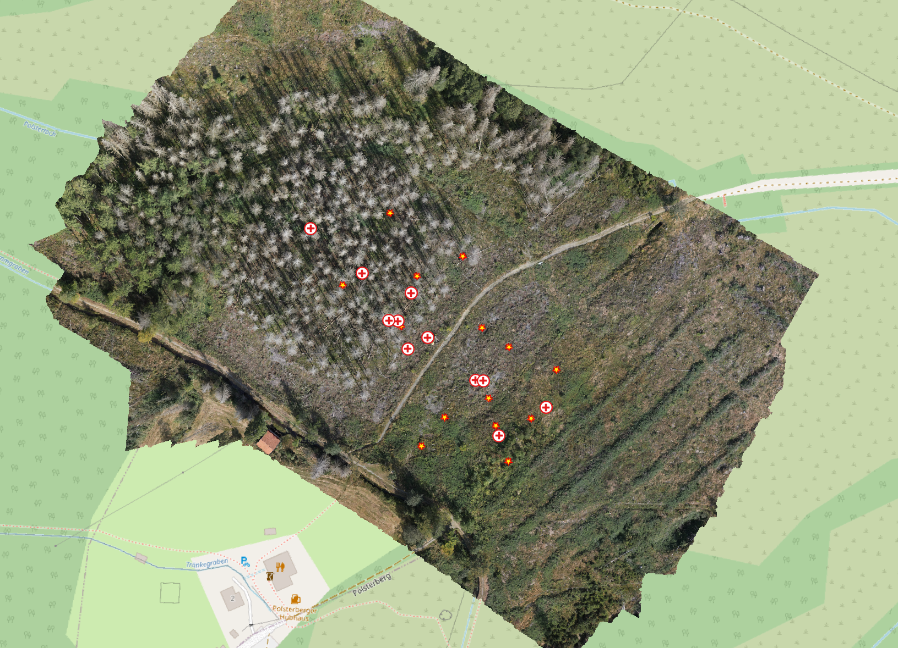

## Why this matters

Geoscientific data rarely describe a complete spatial or spatio-temporal continuum. We usually work with discrete observations: measurement points, pixels, samples, segments, training areas, or selected timestamps. Nevertheless, we often need to make spatial statements about continuous areas and temporal situations.

This is the central problem of the EON warmup: how can incomplete observations be translated into a defensible spatial statement?

Microclimate is only one example. It makes the problem visible because a small number of sensors observe selected locations and timestamps, while the question concerns a spatially connected field. The same logic appears in sampling, UAV and LiDAR workflows, segmentation, regression, classification, interpolation, and validation.

The goal of this reader is not to present interpolation as a detached method collection. The goal is to understand gap filling as a modelling step between observation and spatial claim.

Spatial gap filling is the controlled translation of discrete observations into a spatial statement. The core decisions concern neighborhood, distance, process, scale, statement area, and validation.

The following map shows the project region and the measurement situation used in the warmup.



## Role of this reader

This reader provides the vocabulary for the two EON blocks.

Before the hands-on, it clarifies basic terms: observation point, raster surface, neighborhood, distance, model assumption, and valid statement area. During the hands-on, it helps interpret the four simple model assumptions. In the second block, it supports the critical reading of the generated maps: what they show, what they claim, and where their validity stops.

The EON structure is deliberately small:

```text
discrete observations in reality
-> spatial statement
-> model assumption
-> minimal validation
-> model criticism
```

## Distance and data representation

The first modelling decision is the definition of _proximity_. Proximity is not only a geometric property. It is an operational statement about which observations may inform another location and how strongly they should do so.

Spatial relationships can be described by _**neighborhoods**_ and _**distances**_. Measurement points are zero-dimensional observations: they have a location, but no area. Their neighborhood is therefore often defined by distance: the nearest station, the nearest group of stations, all stations within a radius, or all stations inside a valid statement area. Raster cells have area, so their values refer to cell supports and their distances are evaluated between cell centres or along raster surfaces. The relevant distance rule depends on the support represented in the model.

Tobler’s First Law of Geography provides a common default: near things are more related than distant things.[^tobler1970] This is a useful starting assumption, not a universal law for every process. In many real cases spatial influence cannot be measured directly. It must be operationalized through a distance metric, a neighborhood rule, and a model assumption.

[^tobler1970]: Tobler, W. R. (1970). A computer movie simulating urban growth in the Detroit region. *Economic Geography*, 46(Supplement), 234–240. https://doi.org/10.2307/143141.

A simple Euclidean distance can be a defensible starting point when no stronger process relation or knowledge is available. Other questions may require network distance, travel time, cost distance, flow direction, slope position, wind exposure, or similarity in measurable environmental conditions (covariates). The important step is to state what “near” means for the concrete process and scale of use.

## Filling spatial gaps: concepts

With distance and neighborhood defined, we can turn to gap filling: predicting or assigning values at locations where no observation exists.

Each method encodes an assumption about how values continue between observations. The practical question is therefore not which method is generally best. The practical question is which assumption is defensible for this data situation, this process question, and this intended scale of use.

A spatial continuum derived from point measurements is never a direct observation. It is a modelled statement between observed locations. The same measurement points can lead to different spatial representations — raster fields, Voronoi polygons, buffers, or neighbourhood zones — because the assumptions differ. This is why the this lecture compares simple alternatives instead of hiding the modelling decision inside one polished result.

The four alternatives in the warmup are not a ranking of interpolation methods. They are chosen because each one makes a different modelling assumption visible:

- **nearest station**: the closest observation is taken as the relevant reference;
- **distance decay**: nearby observations receive more weight than distant observations;
- **elevation relation**: temperature is linked to elevation as a simple process-related variable;
- **data-driven patterning from few observations**: a flexible model can create plausible-looking spatial patterns even when the data basis is thin.

More complex methods only become defensible when the process relation, the relevant scale, the data support, and the validation target can be stated clearly. Without that justification, additional complexity does not make the spatial statement stronger. It only hides the modelling decision.

## Process, scale, and method choice

The decisive issue is the spatial claim that the model is supposed to support. Before choosing an algorithm, the process question, the relevant scale, the data support, and the validation target must be clear. Only then can a modelling assumption be defended.

The first question is what kind of spatial relation is plausible. Is the expected pattern controlled mainly by the nearest observation, by gradual distance decay, by a covariate such as elevation, or by a data-driven combination of position and environment? The answer depends on the phenomenon, the station layout, the observation support, and the scale at which the result will be used.

The second question is whether the available data can support the desired complexity. A method with more parameters or more flexible structure is not automatically better. It can produce a convincing-looking surface from very little evidence. If the process relation, scale, and validation target cannot be stated clearly, a simpler method is often the more correct method because it exposes rather than hides the assumption.

For this workflow it means: Voronoi, IDW, and LM altitude are not “primitive” fallbacks. They are transparent statements. Random Forest is included as a _warning_ example because a flexible data-driven surface can look plausible even when the number of points is too small to support a robust spatial interpretation.


## Four EON model assumptions

In all four variants, the measured station temperature is the value to be transferred into space. The methods differ in how they connect these measured values to unsampled locations.

* **Voronoi / nearest station** uses only station position. The measured temperature of the nearest station is assigned to each prediction location.
* **IDW / distance decay** uses station position and distance. The measured temperatures of nearby stations receive more weight than those of distant stations.
* **LM altitude** uses the measured station temperatures as the response variable and elevation as an explanatory variable. The fitted altitude relation is then applied to the DEM.
* **Random Forest** uses the measured station temperatures as the response variable and coordinates plus elevation as explanatory variables. The fitted relation is then applied to all prediction locations.

The important difference is therefore not whether a method “uses the measurements”. All methods use the measured temperatures. The difference is how each method turns those measurements into a spatial statement: by nearest assignment, by distance weighting, by a simple altitude relation, or by a flexible data-driven relation.

### Voronoi / nearest station

Voronoi uses the nearest station. The map becomes a set of hard station areas.

The assumption is piecewise constancy: within each area, the nearest observed value is taken as representative. The effective scale is determined by the station layout. This is transparent and restrictive. It is useful when the task is to expose station control and avoid pretending to know gradients that are not supported by the data.

This method is also useful because it makes the support problem visible. It shows how the study area is partitioned by point location alone. It is often a good first diagnostic when nothing beyond position is justified.

### IDW / distance decay

IDW uses distance weighting. Nearby stations count more than distant stations.

The assumption is gradual isotropic decay from observation points. The spatial pattern is smoother than Voronoi but still mainly controlled by station geometry. The method is easy to understand and useful when local spatial proximity is a plausible but limited assumption.

IDW does not know the process. It does not know wind, shade, cold-air drainage, land cover, or sensor exposure unless these are indirectly reflected in the observed values and station layout.

### LM altitude / simple explanatory model

The linear altitude model uses elevation as a simple explanatory variable.

The assumption is that part of the temperature pattern can be transferred through a relationship with altitude. The predicted values therefore inherit the spatial structure of the DEM. This can be defensible when elevation is a plausible driver at the scale of interest.

This is not a richer microclimate model. It is a deliberately narrow altitude transfer. Local shade, vegetation, surface material, buildings, and drainage processes are outside this assumption unless they are indirectly expressed through elevation or the station values.

### Random Forest / flexible data-driven relation

Random Forest also transfers the measured station temperatures to unsampled locations. In this warmup, the measured temperature is the response variable. Coordinates and elevation are explanatory variables. The model learns a relation from the few station values and then applies that relation to all prediction locations.

This is different from nearest station, IDW, and the altitude model. Voronoi transfers the nearest measured value. IDW transfers measured values through distance weights. The altitude model transfers measured values through one global elevation relation. Random Forest can combine coordinate position and elevation in many local decision rules. The resulting spatial statement can therefore look more detailed than the data situation supports.

The warning is not that Random Forest is generally wrong. The warning is that technical flexibility can hide a weak spatial claim. With few stations, the model may mainly learn where high and low values happened to occur in this specific station layout. A low error value does not prove that the predicted pattern is a defensible microclimatic relation. The result still has to be judged against the process question, the scale of use, the sampling layout, the valid statement area, and the validation target.


## Hands-on: warmup workflow

The warmup follows the minimal script as a compact modelling chain. It starts from prepared station measurements and elevation information, produces four alternative spatial statements, and then reads the resulting maps and RMSE values critically.

The important point is not each technical line of code. The important point is the sequence: observed station values are transferred to unsampled locations, different assumptions produce different spatial representations, and the outputs must be read as modelled statements rather than as direct observations.

The data are prepared so that the warmup can focus on the modelling step. In real projects, this step only becomes defensible after sensor behaviour, timestamps, missing values, CRS, DEM fit, station exposure, and the valid statement area have been checked.

The minimal script is the technical counterpart of this reader. It demonstrates how observed station values are transferred to unsampled locations, and why every resulting spatial representation depends on an explicit modelling assumption.

The real-world link is important. Before such a workflow can be used in an actual project, the measurements would have to be checked: sensor behaviour, timestamps, missing values, coordinate reference systems, DEM fit, station exposure, and the valid statement area all affect what can be claimed. The warmup does not compute a full cleaning workflow. It uses prepared data so that the modelling step itself becomes visible.


## Minimal validation: what is checked?

The warmup does not stop after producing spatial statements. It also asks whether the models can reproduce measurements that were temporarily withheld.

Leave-one-out cross-validation (LOOCV) does this in a simple way: one station is removed, the model is fitted with the remaining stations, and the removed station is predicted. This is repeated for all stations. The difference between observed and predicted station values gives a point-based error.

RMSE summarizes these errors into one number. A lower RMSE means that, in this specific test, the withheld station values were predicted more closely. 

## Reading the spatial statements critically

After the results have been produced, the main task is not to choose the best-looking map or the lowest RMSE. The task is to decide what each spatial statement is allowed to say about the real situation.

For each result, ask:

1. Which measured values are transferred into the unsampled space?
2. Which assumption performs this transfer?
3. Which part of the area is supported by the station layout?
4. Where would the statement turn into extrapolation?
5. Which real process could explain the pattern, and which process is missing?
6. What exactly did LOOCV check: station prediction, spatial process, or only the chosen validation task?

LOOCV is useful because it forces the model to predict known measurements without using them directly. But it remains a point-based test under the given station layout. It does not prove that visible gradients or zones correspond to real microclimatic processes. It also does not test whether the station network covers the relevant situations in the field.

RMSE is therefore a prompt for model criticism. A low RMSE can make a result worth inspecting, but it cannot replace the scientific question: is this spatial statement defensible for the observed process, the data support, the scale of use, and the valid statement area?


## Reality check: prepared data are not raw data

The data are prepared so that the workshop can focus on the modelling step. Real projects require work before modelling starts.

At minimum, the data situation has to be checked: sensor plausibility, timestamp consistency, missing values, coordinate reference systems, DEM reference, station exposure, valid statement area, documentation, and data provenance.

These steps are not developed into a full cleaning workflow in this reader. They are introduced as conditions for valid spatial statements. A map can only be as defensible as the observation network, preprocessing choices, statement area, and validation design behind it.

## Core message

A map from point measurements is not an automatic output. It is a modelled spatial statement.

The correct question is not “which method is best?” The correct question is whether the model assumption, process logic, scale of use, data support, statement area, and validation boundary fit together.

When this cannot be shown, the simpler and more transparent assumption is often the scientifically stronger one.
